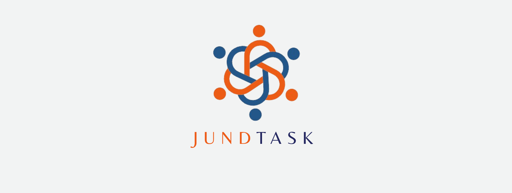

[JAVASCRIPT__BADGE]: https://img.shields.io/badge/Javascript-000?style=for-the-badge&logo=javascript

<h1 align="center" style="font-weight: bold;">JundTask</h1>


![javascript][JAVASCRIPT__BADGE]

<p align="center">
 <a href="#about">Sobre</a> • 
 <a href="#started">Preparação para a inicialização do projeto</a> • 
 <a href="#started">App Routes</a> • 
 <a href="#colab">Collaborators</a> •
 <a href="#started">Contribute</a>
</p>

<p align="center">
    
</p>
<h2 id="about">📌 Sobre</h2>

 A plataforma desenvolvida tem como objetivo facilitar a conexão entre trabalhadores autônomos e clientes na área de Jundiaí, promovendo os serviços desses profissionais de maneira prática e acessível. A interface é projetada para ser intuitiva, permitindo que tanto trabalhadores quanto clientes naveguem facilmente e encontrem o que precisam, auxiliando numa experiência simplificada para ambos os tipos de usuário.


<h2 id="started">🚀 Preparação para a inicialização do projeto</h2>
A inicialização do JundTask é simples, mas é importante garantir que você atenda aos requisitos mínimos para evitar erros. Certifique-se de que está utilizando uma versão igual ou superior às indicadas abaixo.

<h3>Pré requisitos</h3>

<table>
 <tr>
  <td>HTML</td>
  <td>CSS</td>
  <td>Bootstrap</td>
  <td>JavaScript</td>
  <td>PHP</td>
  <td>Xamp</td>
 </tr>
 <tr>
  <td>HTML5</td>
  <td>CSS3</td>
  <td>5.3</td>
  <td>1.8</td>
  <td>8.1.25</td>
  <td>8.1.25</td>
</tr>
</table>

<h3>Clonando o projeto</h3>

A clonagem do projeto pode ser feita apenas digitando a linha de código abaixou ou baixando o projeto.

```
git clone https://github.com/Gineris/siteatualizado.git
```

<h3>Inicializando o projeto</h3>

Após clonar para começar precisará estar iniciar o XAMPP e importar o banco de dados que está no repositorio, ele é necessário para usar as funções do site, em seguida com o repositório na pasta "htdocs" é só colocar a url no seu navegador.
Esta será sua tela inicial:


